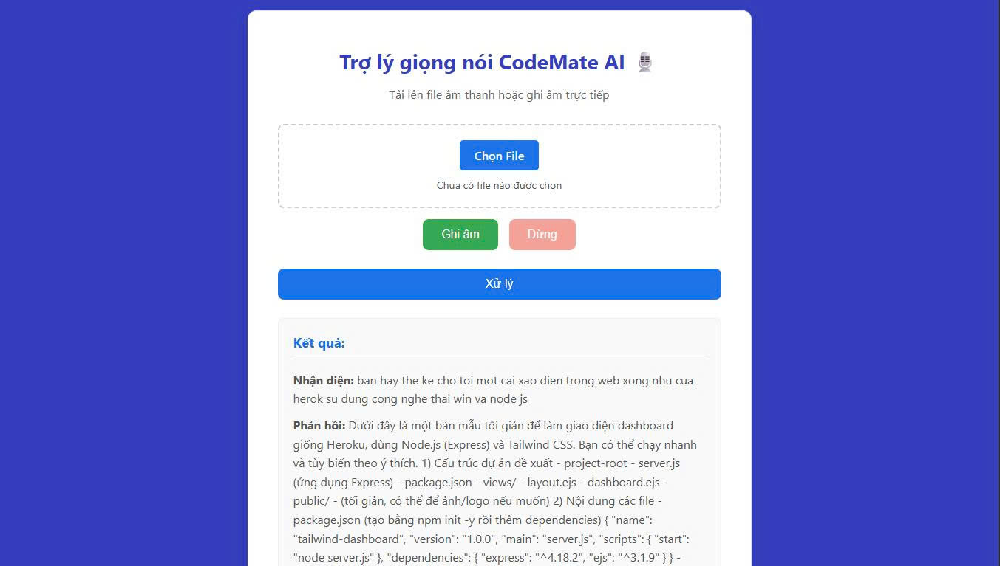

# CodeMate AI - Trợ Lý Lập Trình Bằng Giọng Nói Tiếng Việt

**CodeMate AI** là một dự án ứng dụng trí tuệ nhân tạo, cho phép lập trình viên tương tác và đưa ra yêu cầu bằng giọng nói Tiếng Việt để nhận lại các đoạn mã (code snippet), giải thích thuật toán, hoặc các câu trả lời liên quan đến lập trình.

Dự án được xây dựng với mục tiêu tăng tốc độ làm việc, hỗ trợ học tập và tạo ra một phương thức tương tác tự nhiên hơn với máy tính cho cộng đồng lập trình viên Việt Nam.

 


## ✨ Tính Năng Nổi Bật

* **Nhận diện giọng nói Tiếng Việt**: Sử dụng mô hình **Whisper** để đạt độ chính xác cao khi chuyển đổi giọng nói thành văn bản.
* **Phản hồi Thông minh**: Tích hợp **OpenAI API** để hiểu ý định người dùng và tạo ra các câu trả lời, đoạn mã và giải thích chất lượng.
* **Giao diện Web Trực quan**: Giao diện người dùng đơn giản, dễ sử dụng được xây dựng bằng HTML, CSS và JavaScript.
* **Kiến trúc Backend Mạnh mẽ**: Sử dụng **Flask (Python)** để xử lý các tác vụ AI một cách hiệu quả.

## 🚀 Cài Đặt và Chạy Dự Án

### Yêu Cầu
-   Python 3.9+
-   Git
-   Một API key từ OpenAI

### Hướng Dẫn Cài Đặt

1.  **Clone repository về máy:**
    ```bash
    git clone [https://github.com/ElfiDeeper/CodeMate-AI.git](https://github.com/ElfiDeeper/CodeMate-AI.git)
    cd CodeMate-AI
    ```

2.  **Tạo và kích hoạt môi trường ảo:**
    ```bash
    python -m venv venv
    # Trên Windows
    .\venv\Scripts\activate
    # Trên MacOS/Linux
    source venv/bin/activate
    ```

3.  **Cài đặt các thư viện cần thiết:**
    ```bash
    pip install -r requirements.txt
    ```

4.  **Cấu hình API Key:**
    -   Tạo một file mới tên là `.env` trong thư mục `backend`.
    -   Thêm API key của bạn vào file `.env` như sau (thay `YOUR_API_KEY_HERE` bằng key thật của bạn):
        ```
        OPENAI_API_KEY="YOUR_API_KEY_HERE"
        ```

5.  **Chạy Backend Server:**
    ```bash
    cd backend
    python nlp_main.py
    ```
    Server sẽ chạy tại `http://127.0.0.1:5000`.

6.  **Mở Giao diện Người dùng:**
    -   Mở file `frontend/index.html` bằng trình duyệt của bạn.

Bây giờ bạn có thể bắt đầu sử dụng ứng dụng!

## 🛠️ Công Nghệ Sử Dụng

-   **Frontend**: HTML, CSS, JavaScript
-   **Backend**: Python, Flask
-   **AI/ML**:
    -   **Speech-to-Text**: `Duke03/whisper_medium_finetuned_vi`
    -   **Language Understanding & Generation**: OpenAI API (`gpt-5-nano`)
-   **Thư viện Python**: `transformers`, `torch`, `librosa`, `openai`, `flask_cors`, `python-dotenv`, `mysql-connector-python`

## 🤝 Đóng Góp

Mọi sự đóng góp để cải thiện dự án đều được chào đón! Vui lòng tạo một `Pull Request` hoặc mở một `Issue` để thảo luận về những thay đổi bạn muốn thực hiện.

## 📄 Giấy Phép

Dự án này được cấp phép theo Giấy phép MIT.
