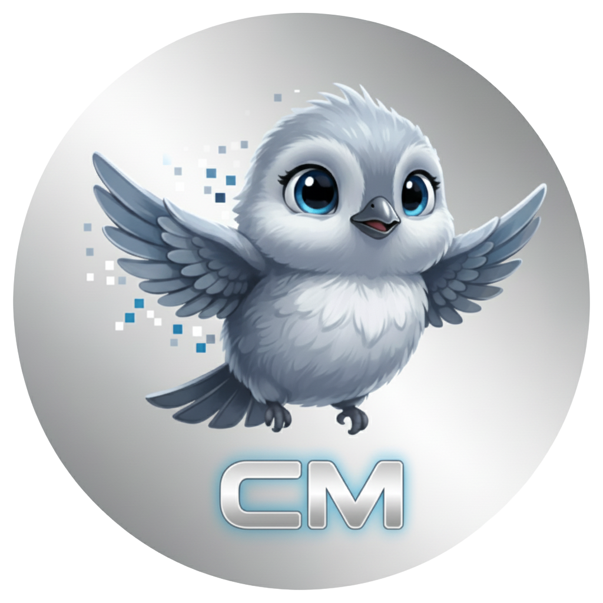
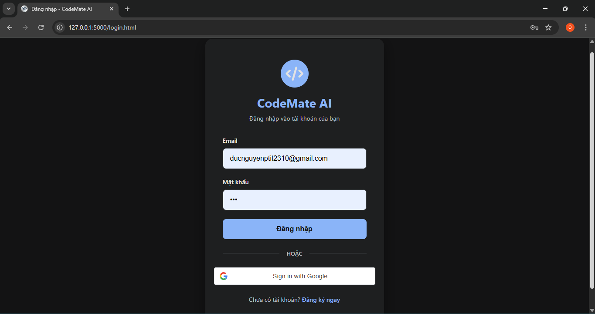
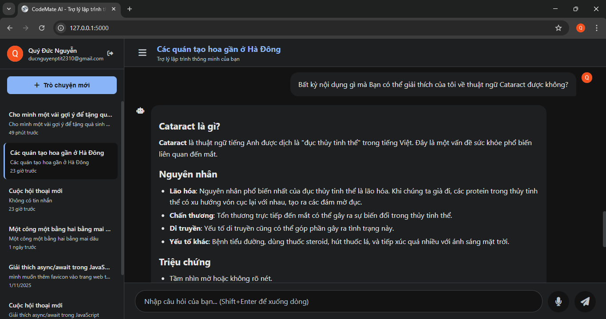

# 🤖 CodeMate AI

> Trợ lý lập trình thông minh với AI, hỗ trợ chat văn bản và giọng nói (tiếng Việt)



## 📸 Giao diện ứng dụng

### Trang đăng nhập


### Giao diện chat chính


---

## ✨ Tính năng

- 🎙️ **Chat bằng giọng nói**: Hỗ trợ nhận diện giọng nói tiếng Việt với Whisper
- 💬 **Chat văn bản**: Giao diện hiện đại, hỗ trợ Markdown
- 🔐 **Xác thực đa dạng**: Đăng nhập bằng Email/Password hoặc Google OAuth
- 💾 **Lưu lịch sử**: Quản lý nhiều cuộc hội thoại
- 🎨 **Giao diện đẹp mắt**: Dark theme, responsive
- 🚀 **Hiệu năng cao**: Sử dụng connection pool, async processing

---

## 🛠️ Công nghệ sử dụng

### Backend
- **Flask** - Web framework
- **OpenAI GPT-4** - AI model chính
- **Faster-Whisper** - Speech-to-text (tiếng Việt)
- **MySQL** - Database
- **Google OAuth 2.0** - Xác thực

### Frontend
- **Vanilla JavaScript** - Không framework
- **Marked.js** - Markdown rendering
- **Font Awesome** - Icons
- **CSS3** - Styling hiện đại

---

## 📦 Cài đặt

### 1. Clone repository

```bash
git clone https://github.com/SilverFledgling/CodeMate-AI.git
cd CodeMate-AI
```

### 2. Cài đặt dependencies

```bash
# Backend
cd backend
pip install -r requirements.txt
```

### 3. Cấu hình Database

```bash
# Đăng nhập MySQL
mysql -u root -p

# Chạy script tạo database
mysql -u root -p < backend/database.sql
```

### 4. Cấu hình Environment Variables

Tạo file `.env` trong thư mục `backend/`:

```bash
cp .env.example .env
```

Chỉnh sửa file `.env` với thông tin của bạn:

```env
OPENAI_API_KEY=your_openai_api_key_here
DB_PORT=3306
DB_HOST=localhost
DB_USER=root
DB_PASSWORD=your_password
DB_NAME=codemate_db
SECRET_KEY=your_secret_key_here
GOOGLE_CLIENT_ID=your_google_client_id_here
```

**Lấy API Keys:**
- OpenAI API Key: https://platform.openai.com/api-keys
- Google Client ID: https://console.cloud.google.com/apis/credentials

### 5. Chạy ứng dụng

```bash
# Trong thư mục backend/
python nlp_main.py
```

Truy cập: **http://localhost:5000**

---

## 📂 Cấu trúc thư mục

```
CodeMate-AI/
│
├── backend/
│   ├── nlp_main.py          # Flask server chính
│   ├── database.py          # Database operations
│   ├── database.sql         # Database schema
│   ├── requirements.txt     # Python dependencies
│   └── .env                 # Config (không commit)
│
├── frontend/
│   ├── index.html          # Trang chat chính
│   ├── login.html          # Trang đăng nhập
│   ├── script.js           # JavaScript logic
│   └── style.css           # Styling
│
├── images/
│   ├── CodeMate_AI.png     # Logo/favicon
│   ├── login-page.png      # Screenshot login
│   └── main-interface.png  # Screenshot main
│
├── .gitignore
├── .env.example
└── README.md
```

---

## 🔐 Bảo mật

- ✅ Mật khẩu được hash bằng bcrypt
- ✅ Session-based authentication
- ✅ CORS được cấu hình chặt chẽ
- ✅ Google OAuth 2.0 token verification
- ✅ SQL injection protection với parameterized queries

---

## 🚀 Deployment

### Sử dụng Waitress (Windows) hoặc Gunicorn (Linux)

```bash
# Windows
waitress-serve --port=5000 nlp_main:app

# Linux
gunicorn -w 4 -b 0.0.0.0:5000 nlp_main:app
```

---

## 🐛 Troubleshooting

### Lỗi kết nối database
```bash
# Kiểm tra MySQL đang chạy
# Windows
net start MySQL80

# Linux
sudo systemctl start mysql
```

### Lỗi Whisper model
```bash
# Model sẽ tự động tải lần đầu chạy
# Nếu lỗi, xóa cache và thử lại:
rm -rf ~/.cache/huggingface
```

---

## 📝 Tính năng sắp tới

- [ ] Dark/Light mode toggle
- [ ] Export chat history
- [ ] File upload support
- [ ] Voice output (TTS)
- [ ] Multi-language support
- [ ] Code execution sandbox

---

## 👨‍💻 Tác giả

**Đức Nguyễn**
- GitHub: [@SilverFledgling](https://github.com/SilverFledgling)
- Email: ducnguyenpti2310@gmail.com

---

## 📄 License

MIT License - xem file [LICENSE](LICENSE) để biết thêm chi tiết.

---

## 🙏 Acknowledgments

- OpenAI GPT-4 API
- Faster-Whisper (Systran)
- Google Identity Services
- Font Awesome Icons

---

⭐ **Nếu project hữu ích, hãy cho mình một star nhé!**